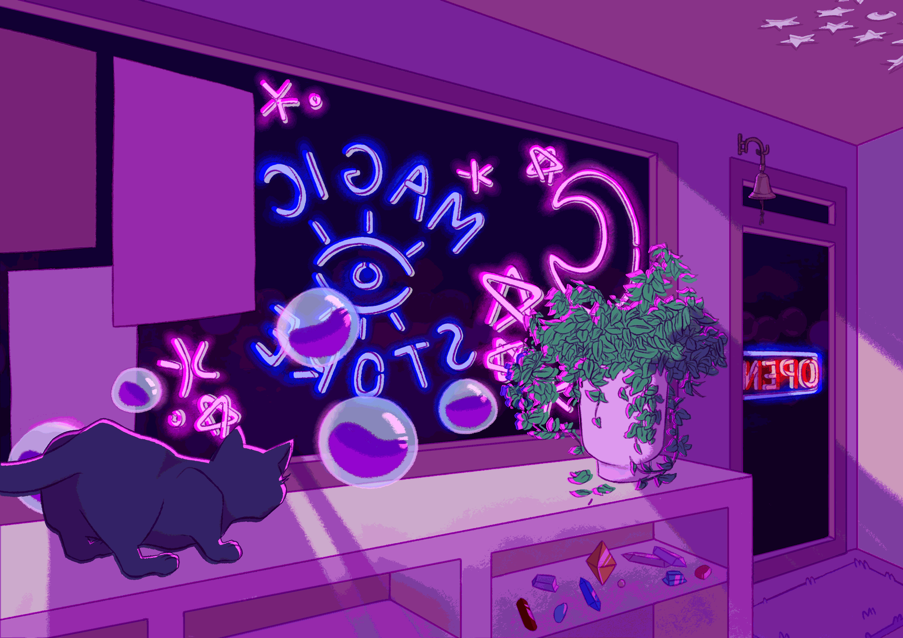

 

<h1 align="center">👋Hello! I am PreSicvl!</h1>

<h2 align="center">Computer science student from Russia</h2>

  

---

## Core

---

## Social

 <a href="https://www.github.com/Svyatoslav-Vtulkin" target="_blank" rel="noreferrer"> <picture> <source media="(prefers-color-scheme: dark)" srcset="https://raw.githubusercontent.com/danielcranney/readme-generator/main/public/icons/socials/github-dark.svg" /> <source media="(prefers-color-scheme: light)" srcset="https://raw.githubusercontent.com/danielcranney/readme-generator/main/public/icons/socials/github.svg" />  </picture> </a>

---

 

---

## 🙋‍♂️ About Me

🚀 *Vtulkin Svyatoslav*

💡 **Projects:**
1. NoN;

🛠️ **Skills:**
- **Languages:** Python;
